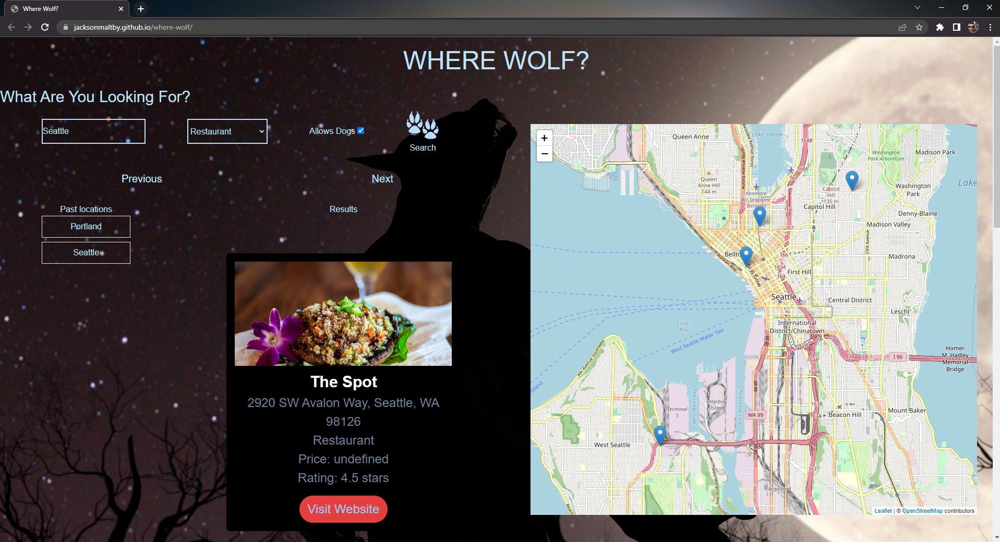

# Where Wolf?

## Description

Where Wolf? is a search application that allows users to search for different types of businesses in a chosen location that either do or don't allow dogs. It uses the Yelp Fusion API to retrieve businesses with the desired search parameters, and then displays those businesses on an interactive map via the Leaflet API.

## Features

* User-friendly interface for searching for local businesses that allow (or don't allow) dogs.
* Provides search results including name of business, location, and type of business.
* Displays resulting businesses on an interactive map that is built into the web page.
* "Next" and "Previous" buttons to display next or previous set of 4 results given search parameters.

## Usage

1. Open up the page using the provided link.
2. Open up the console using the "inspect" button, and then hit the "Search" button.
3. Copy the link attached to the error message in the console, and paste it into a new tab.
4. Request temporary access to the demo server to allow the Yelp API to function.
5. Enter desired location, type of business, and whether or not you want dogs allowed.
6. Click the "Find" button to find businesses that meet search parameters, and display them both as a list and as points on the interactive map.
7. Click "Next" or "Previous" button in order to display a new set of four results.

## Credits

* [Kyle Parks](https://github.com/Goobber33)
* [Erin Wallace](https://github.com/moeba84)
* [Brandon Guerrero](https://github.com/bg2398)
* [Jackson Maltby](https://github.com/jacksonmaltby)

## Technologies Used

* HTML
* CSS
* JavaScript
* Tailwind
* Yelp Fusion API
* Leaflet API

## Screenshot of Live Page

## Link to Live Page

[Where Wolf?](https://jacksonmaltby.github.io/where-wolf/)

## License

MIT License (More info in Repo)